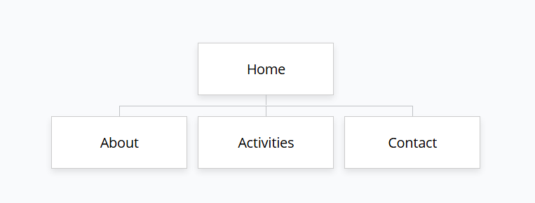

# Website Plan

## Website subject

Dolphins. Swimming Club

## Purpose

Descriptions of swimming strokes. 
The history of modern swimming. 
Tips for beginner and advanced swimmers. 
Advice from coaches. 
Events organized by the club. 
Become a club member. 
Latest articles on world swimming.

## Target users

Adults, children, the elderly, families.

## Required pages

| Page | Filename | Planned content |
|---|---|---|
| Home | index.html | Website introduction, key message and highlights |
| About | about.html | Background, purpose, values or history |
| Activities | activities.html | Services, products, events or activities |
| Contact | contact.html | Address, opening times, email and travel information |

## Shared content

Website name, Logo, Navigation, Footer

## Colour ideas

#0FB8BE
#374151
#ffffff

## Website structure

The navigation bar will remain fixed at the top of the screen at all times. 
This eliminates the need for the user to scroll back to the top to navigate to another page. 

Additionally, related content from other pages will allow the user to visit those pages without leaving the current one.

## Sitemap
